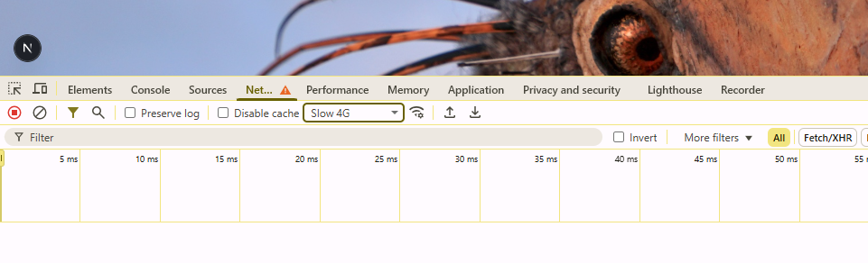

# Starting New Project


```typescript
npx create-next-app
```

What is your project name? .

**npm run build** will optimise code when in production

greyed out files will not be pushed to stop credentials being leaked .env evn.loca

next-env.d.ts // do not touch for auto creating ts definitions in project

one git.ignore to stop files being pushed to repo will be greyed out then 

# Running Project

**npm run dev**

next dev --turbopack flag // means will make use of use of bundling tool to make dev perf faster

```typescript
npm run dev triggers dev command in json
```

Can use localhst:3000 30001, etc

// npm install

// 

{

  "name": "nextjs-course",

  "version": "0.1.0",

  "private": true,

  "scripts": {

    "dev": "next dev --turbopack",

    "build": "next build",

    "start": "next start",

    "lint": "next lint"

  },

npm run lint // check for linting issues relating to style, syntax check if code looks nice.

cannot put comments in json

.env not included when pushing code so not to leak credentials

public folder in react and next is same. It contains static files that can be served directly to the client. If want image or svg file put in public folder since make easier to directly import this into project. It also makes images accesible through URL.

public uses lazy loading and download images onto machine faster avoid URLs


http://localhost:3001/globe.svg to access images in public folder


# app folder

contain globals.css which is basically css file for project

layout.tsx // build html for project. Only can change return part nothing else. Children is dep on what route I am in eg about, contact. Everything above children affects every page 


# Client Server Side Components

If have client component will render on browser 

by default about, contact all server side, add "use client"; to carry out function like button

advantage of server side is it loads faster especially for dynamic and static pages. The are pre-rendered for SEO. Client components are worst for SEO. 

Server functions allow to make async


https://jsonplaceholder.typicode.com/posts


userId is name of param adding to route. UserId is camelcase not ID. Put [] around so nextJS knows it is param.


# Testing

check if greater than number of current users. Trigger 404 page not found or more personalized one.

Save All handy if fixing errors like buttons or server and client rendering together

shift + Alt + F to align html elements

Can simulate slow internet below help with SEO for serverside rendering and coming up with loading screens.



if not routing to page put outside app to avoid confusion eg components in ecoomerce

lib folder used for storing utility files, shared logic, library functions etc eg prisma.ts, strip.ts, utils.ts

in next.js can build own backend logic directly within your app. So instead of having to set up a separate server with API routes using ExpressJS and creating routes to define endpoints that handle HTTP requests through API routes

want to make endpoint that is going to be called through the /hello route. It is called route.ts and is typescript

API definition makes sense in client component but in server component doesn't work 


# env.local

NEXT_URL="http://localhost:3000" change to website URL


metadata is managed in a declarative way using metadata property that exists in every single .tsx file.
